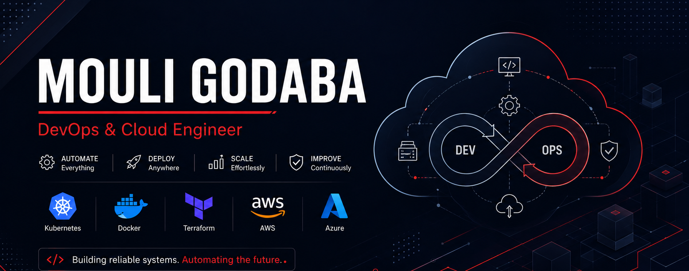

<div align="center">



</div>

<br/><br/>


Aspiring DevOps & Cloud Engineer with a BSc in Mathematics, Electronics & Computer Science, plus hands-on DevOps training covering containerization, orchestration, infrastructure as code, and CI/CD automation. Deployed and hosted a serverless application on Azure Functions with an automated GitHub Actions CI/CD pipeline, including auth and cross-origin configuration. Currently pursuing the Microsoft Azure AZ-104 certification.

```
currently_building : "Production-ready auto-healing K8s infrastructure"
currently_learning  : "Azure AZ-104", "AWS Cloud Practitioner"
trained_at          : "Xtream Tech, Hyderabad — Docker, K8s, Terraform, Ansible, AWS, Azure"
ask_me_about        : "Serverless deployments, GitHub Actions CI/CD, K8s self-healing"
```


<div align="center">

**Cloud & Infrastructure as Code**


**Containers & Orchestration**


**CI/CD & Observability**


</div>


**azure-resume-api** &nbsp;  &nbsp;·&nbsp; **Cloud-Native-Microservices-Observability-Auto-Scaling-Infrastructure** &nbsp; 

### azure-resume-api — Serverless Resume API

A cloud-native backend that serves my resume data as JSON over a REST endpoint — fully serverless on Azure, scales automatically, zero compute cost when idle.

- **Architecture:** Azure Function triggers on HTTP GET, retrieves structured resume JSON (experience, skills, certifications), returns it with a 200 OK response.
- **CI/CD:** GitHub Actions workflow deploys to Azure automatically on every push to main — no manual deployment steps.
- **API Security:** Configured CORS to explicitly allow only trusted origins after debugging a browser-side CORS block when calling the API from my portfolio frontend.
- **Debugged a real production issue:** Resolved an SCM authentication failure between GitHub Actions and Azure by correctly wiring the Function App's publish profile into GitHub Secrets.
- **Roadmap:** Migrating hardcoded data to Azure Cosmos DB, adding API Management for rate-limiting and view analytics.

<div align="center">

[](https://resume-api-30847.azurewebsites.net/api/cv)
[](https://github.com/moulisiddhu487-svg/azure-resume-api)

</div>

<br/>

### Cloud-Native-Microservices-Observability-Auto-Scaling-Infrastructure — Kubernetes Observability & Auto-Scaling Platform

Deploys and monitors an 11-service microservices app (Google's Online Boutique) on a Kubernetes cluster (K3s on AWS EC2), with automatic pod recovery, CPU-based autoscaling, and live Prometheus/Grafana monitoring — built to demonstrate real reliability engineering, not just "I ran a container."

- **Microservices Deployment:** 11 services (frontend, cart, catalog, currency, payment, shipping, email, checkout, recommendation, ad, load generator) running as isolated pods communicating over internal Kubernetes DNS.
- **Auto-Scaling (HPA):** CPU-based Horizontal Pod Autoscaling on `frontend` (1–3 pods), `cartservice` (1–3 pods), and `recommendationservice` (1–2 pods) — replicas scale up automatically past an 80% CPU target.
- **Self-Healing:** Configured Liveness/Readiness probes so Kubernetes detects and replaces unhealthy or deleted pods automatically, without manual intervention.
- **Observability:** Prometheus and Node Exporter collecting cluster/pod-level metrics, visualized in real-time Grafana dashboards with alerting rules.
- **Validated under load:** Ran controlled failure and load tests (pod deletion, load-generator traffic spikes) via `kubectl` to confirm self-healing and scaling behavior end-to-end.
- **Lab setup, production-portable:** Runs on a single AWS EC2 instance using K3s — a lightweight, CNCF-certified Kubernetes distribution. All manifests, HPA rules, and Helm charts are directly portable to a managed cluster like AWS EKS with no changes.

<div align="center">

[](https://github.com/moulisiddhu487-svg/Cloud-Native-Microservices-Observability-Auto-Scaling-Infrastructure)

</div>


<div align="center">

<table>
<tr>
<td align="center" width="110">
<a href="https://www.linkedin.com/in/mouli-godaba-121a4525a/">

<br/>
<sub><b>LinkedIn</b></sub>
</a>
</td>
<td align="center" width="110">
<a href="mailto:moulisiddhu487@gmail.com">

<br/>
<sub><b>Gmail</b></sub>
</a>
</td>
<td align="center" width="110">
<a href="https://mouli-portfolio-six.vercel.app/">

<br/>
<sub><b>Portfolio</b></sub>
</a>
</td>
</tr>
</table>

</div>


<div align="center">


<picture>
  <source media="(prefers-color-scheme: dark)" srcset="https://raw.githubusercontent.com/moulisiddhu487-svg/moulisiddhu487-svg/output/github-contribution-grid-snake-dark.svg">
  
</picture>

</div>


