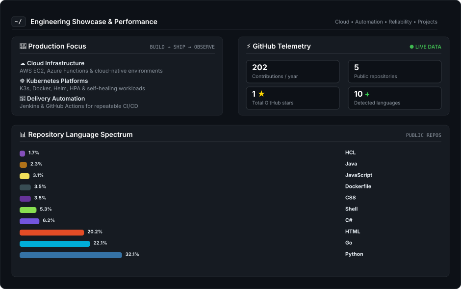

  
  
    

  # Mouli Venkata Narsimha Godaba
  
  

    
  

  ### Automating Infrastructure & Cloud Deployments
  
  **DevOps & Cloud Engineer • Cloud Automation • Kubernetes**

   

 
 &nbsp;
  
  &nbsp;
  
  &nbsp;
  

---

### 👨‍💻 About Me

I am an entry-level **Cloud & DevOps Engineer** specializing in Linux systems administration, AWS cloud infrastructure, and Kubernetes orchestration. I focus on building reliable, cost-efficient infrastructure, troubleshooting system-level bottlenecks, and replacing manual operational steps with repeatable automation.

* ☁️ **AWS & Linux Infrastructure:** Hands-on administering Linux environments and core AWS services (EC2, VPC, Security Groups), designing cost-optimized compute setups, and enforcing host-level security.
* ☸️ **Kubernetes Microservices Platform:** Architected an 11-microservice Google Online Boutique on **K3s with Jenkins CI/CD**, integrating dynamic HPA auto-scaling, **< 5s native self-healing**, and Prometheus/Grafana health alerts.
* ⚡ **Serverless Cloud APIs:** Built and deployed a public cloud-hosted **RESTful JSON Resume API on AWS**, optimizing payload delivery for **sub-100ms** latency and configuring secure CORS headers.
* 🛠️ **System Reliability & Automation:** Experienced in terminal-level troubleshooting, container lifecycle management, Shell scripting for disaster recovery, and eliminating infrastructure configuration drift.
* 🎯 **Career Focus:** Seeking an entry-level / junior Cloud & DevOps Engineering role to help teams automate release cycles, optimize cloud spend, and maintain high platform availability.
  
---

### 📡 Technical Capability & Skills Radar

  

---

### 🛠️ Core Tooling & Technologies

| **Category** | **Technologies** |
| :--- | :--- |
| **Cloud & Infrastructure** |  |
| **Containers & Orchestration** |  |
| **CI/CD & Automation** |  |
| **Monitoring & Systems** |  |

---

### 📈 Activity & Contribution Flow

  

---

### ⚡ Engineering Showcase & Performance

  

---

### 🌐 Beyond the Terminal

I enjoy staying curious beyond day-to-day engineering and continuously exploring new ways to learn, create, and recharge.

* **🎮 Competitive Gaming:** Enjoy competitive gaming as a way to reset, stay focused, and have fun outside engineering.
* **🌐 Technology & Exploration:** Naturally curious about emerging technologies, developer tools, cloud platforms, and interesting ideas.
* **🍿 Anime & Entertainment:** Enjoy anime and entertainment during downtime, especially after long periods of learning and building.

### 🚀 Featured Projects

**Azure Resume API**  
Serverless resume REST API deployed on Azure Functions with GitHub Actions CI/CD.  
[Live API](https://resume-api-30847.azurewebsites.net/api/cv) • [GitHub Repository](https://github.com/moulisiddhu487-svg/azure-resume-api)

**Cloud-Native Microservices Observability & Auto-Scaling Platform**  
11-service Online Boutique on K3s/AWS with HPA, Prometheus, Grafana, alerts and Jenkins delivery.  
[GitHub Repository](https://github.com/moulisiddhu487-svg/Cloud-Native-Microservices-Observability-Auto-Scaling-Infrastructure)

*Explore the implementation and source code through the links above.*

---

### 🎓 Education & Certification

* BSc Computer Science (BSc MECS) — B.R.R. & G.K.R. Chambers Degree & PG College, Palakollu — July 2025
* DevOps Training Program — Xtream Tech, Hyderabad — Feb 2026 to Jul 2026
* 🏅 Microsoft Azure Administrator Associate (AZ-104) — In Progress

---

  Building reliable infrastructure. Automating the path to production.

